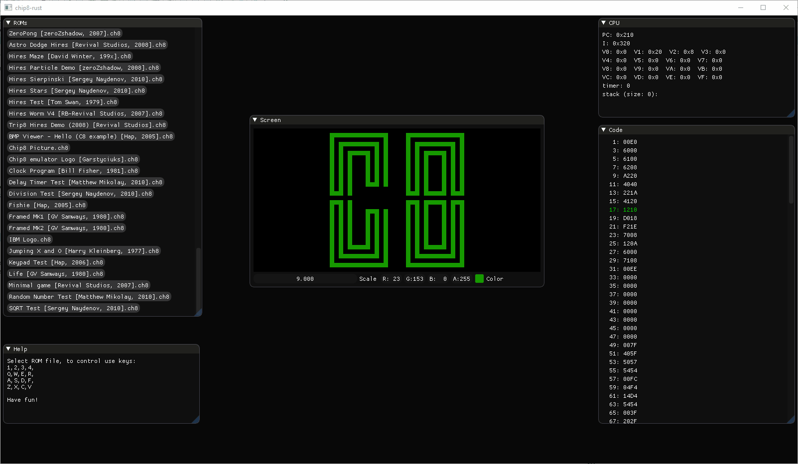

# CHIP-8 Emulator in Rust

UI is based on ImGui and shows some internals (CPU state, code).



## How to run

```
> cargo run
```


## Acknowledgements

* ROMs used from this repo: https://github.com/dmatlack/chip8/tree/master/roms
* ImGui wgpu backend was taken from here: https://github.com/unconed/imgui-wgpu-rs and hacked to add basic support for updating/reuploading textures.
